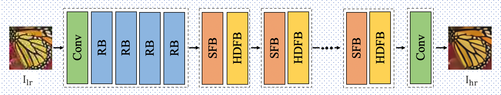

# Mixed degraded image adaptive restoration based on hierarchical feature fusion

This code attempts to restore the degraded image mixed with Gaussian noise, Gaussian blur and JPEG compression from the perspective of hierarchical feature fusion.
## Network


### datasets
The mixed degradation datasets is made in the same way as [RL restore](https://github.com/yuke93/RL-Restore). In order to speed up the data reading, we save the data in npz format.

## Usage
The code has been tested on CPU and GPU environments.
### Requirement
* Python  3.7
* PyTorch 1.5

### train
```shell
python train.py -g 1
```
### test
test on the test datasets
```shell
python test.py -g 1
```
test on the your datasets
```shell
python test_for_your_data.py -g 1
```